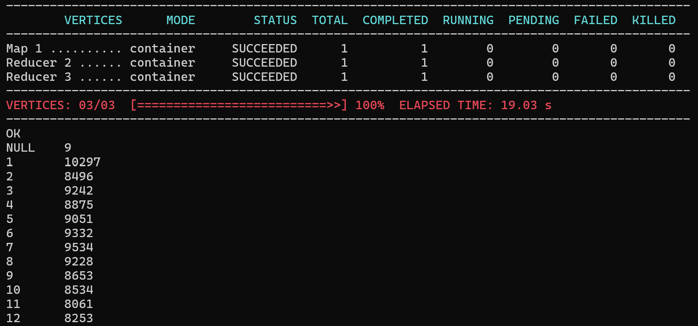

### Загрузка данных

```
scp hadoop2.zib <user>@<ip>:/home/<user>
```

### Распаковка

```
unzip hadoop2.zib
rm hadoop2.zib

gzip -d /home/$USER/hadoop2/data2/ok/coreDemography/part-r-000*.gz

hdfs dfs -mkdir /home/$USER/coreDemography
hdfs dfs -copyFromLocal /home/$USER/hadoop2/data2/ok/coreDemography/* /home/$USER/coreDemography/

```


### Создание БД

```
create database user_db
location '/user/$USER/warehouse';

use user_db;
SELECT current_database();
```

### Создание таблицы

```
create external table demography (
    id INT,
    create_date BIGINT,
    birth_date INT,
    gender TINYINT,
    id_country BIGINT,
    id_location INT,
    login_region INT
)
row format delimited
fields terminated by '\t'
lines terminated by '\n'
location '/home/a.eliseev/coreDemography';

```


### Запрос

```
select month, count(1) as cnt from (
    select ( 
        extract(month from date_add('1970-01-01', birth_date))
    ) as month
    from demography
) temp 
group by month order by month;
```


### Удаление БД

```
drop database user_db;
```

### Результат



